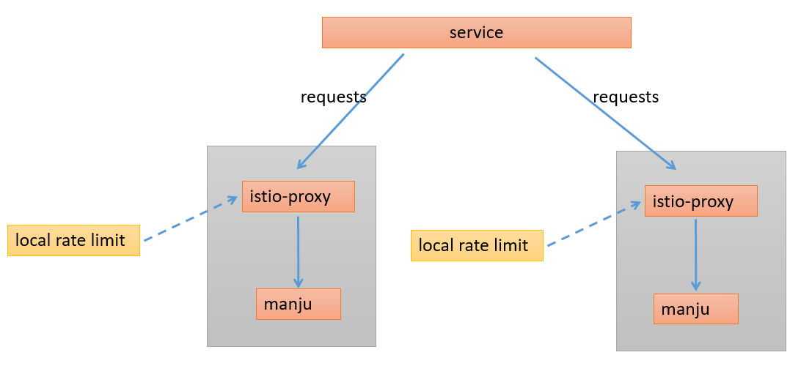
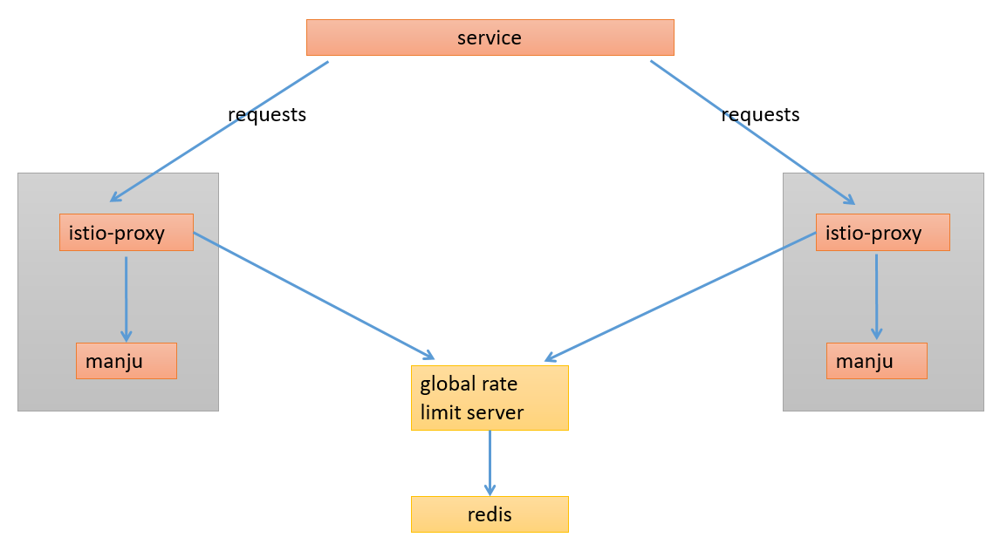
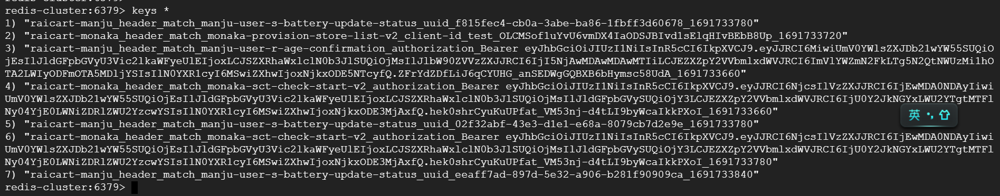

# 1. 本地限流与全局限流

## 1.1 本地限流

## 1.2 全局限流

## 1.3 两种限流的区别

|  | 本地限流 | 全局限流 |
|--|---------|----------|
| 架构 | 不依赖rate-limit-server服务，istio-sidecar即可实现 | 依赖rate-limit-server服务 |
| 算法 | 令牌桶算法 | 固定窗口限流，即单位时间内允许n个请求 |
| 功能 | descriptors的value不能为空，因此，它不能对远程IP不确定、header值不确定的请求进行限流 | descriptors的value可以为空。当value为空时，如果两个请求的value值不同，则各自单独限流，互不挤占流量 |

# 2. Demo

请参考目录 demo-rate-limit

# 3. 现行方案

采用全局限流：
- 在每个集群中部署一套 `redis + rateLimitServer`，使用argoCD管理，helm在`manju-helm`工程中。
- 每个应用中增加`EnvoyFilter`资源，并设置开关。
- 在`rateLimitServer`中，使用configmap维护限流规则，每个应用对应一个配置文件，每个配置文件开头定义一个`domain`。例如，`manju`对应的配置文件是`config-manju.yaml`，定义的`domain`是`raicart-manju`。
- 在`EnvoyFilter`中，需要指定对应的`domain`，例如，`manju`需要指定`domain`为`raicart-manju`。
- `/`，`/ping`，`/metrics` 接口在armor层做限流，不在ASM中做。

设置限流后，redis中会保存访问数据

# 4. 参考资料

- https://istio.io/latest/docs/tasks/policy-enforcement/rate-limit/
- https://www.aboutwayfair.com/tech-innovation/understanding-envoy-rate-limits
- https://discuss.istio.io/t/envoy-local-rate-limit-by-ip-address-using-remote-address-not-working/12718
- https://github.com/envoyproxy/ratelimit
